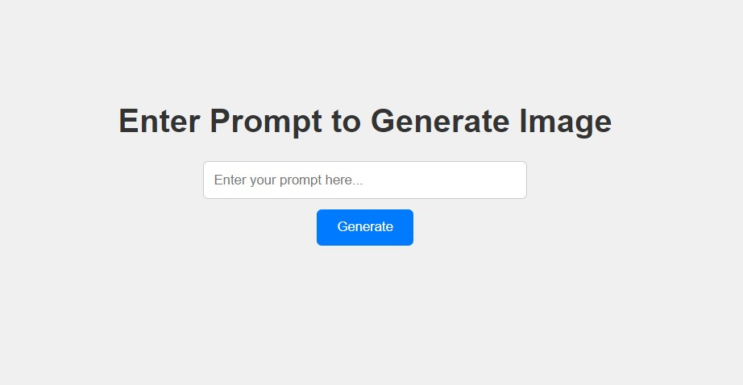
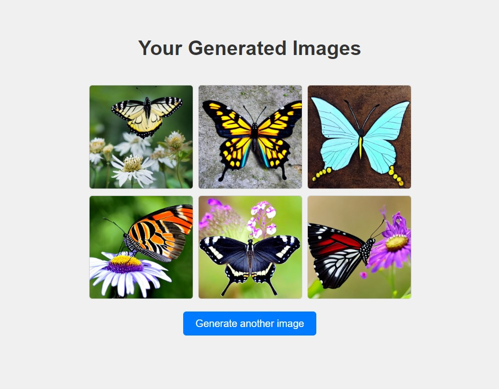

# Task2-CodeTech
NAME: Dhara Savani  
DOMAIN NAME: Machine Learning  
INTERN ID: CT08DS1649  
BATCH DURATION: JUNE to JULY 2024  
MENTOR: SRAVANI GOUNI

## Overview of the Project

### Project: TEXT-TO-IMAGE GENERATION APPLICATION

This repository contains a Flask web application that generates images using the Stable Diffusion model. Users can input a textual prompt, and the application generates corresponding images based on the input.

## Screenshots of Generated Pages

### Index Page



### Result Page



## Objective

The objective of this project is to create a user-friendly web application that leverages advanced machine learning models to convert textual descriptions into visual images. This aims to demonstrate the capabilities of the Stable Diffusion model and provide an interactive platform for users to generate and explore AI-generated images

## Key Activities

1. Setting up a Flask application for web-based interaction.
2. Integrating the Stable Diffusion model to handle text-to-image generation.
3. Utilizing Ngrok for providing a public URL to the local Flask application.
4. Creating HTML templates for user input and displaying generated images.
5. Styling the web application using CSS for a better user experience.

## Technology Used

- Flask
- Pyngrok
- Diffusers
- Accelerate
- Torch
- PIL (Python Imaging Library)


## Setup Instructions

1. **Clone the Repository:**

    ```sh
    git clone https://github.com/ds954/CodeTech-Task2.git
    cd CodeTech-Task2
    ```

2. **Install Dependencies:**

    ```sh
    pip install -r requirements.txt
    ```

3. **Run the Application:**

    ```sh
    python app.py
    ```

## Dependencies

- Flask
- Pyngrok
- Diffusers
- Accelerate
- Torch
- PIL

## Project Structure

- `app.py`: Main application file.
- `requirements.txt`: Contain required libraries 
- `templates/`: Contains HTML templates.
  - `index.html`: Form to input prompt.
  - `result.html`: Displays generated images.
- `static/`: Contains static files (e.g., CSS).
  - `styles.css`: Styling for the web application.
  - `generated_images/`: Folder for storing generated images.

## Usage

1. Open the application in your browser using the Ngrok URL provided in the terminal.
2. Enter a prompt to generate images.
